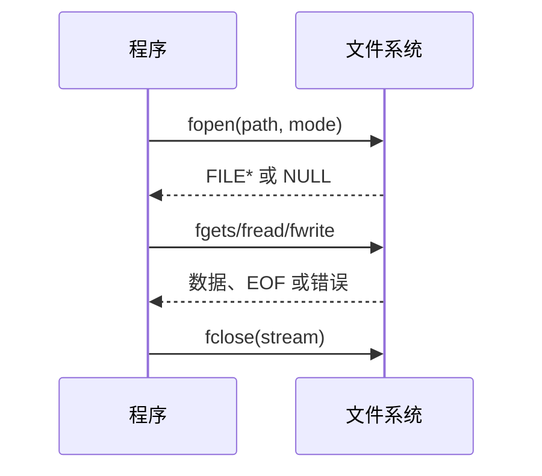

### 文件流与随机访问

文件操作遵循“打开、检查、读写、关闭”的顺序。`fopen` 失败时返回 `NULL`，`perror` 可以把系统错误原因写出来：

```c
FILE *fp = fopen("scores.txt", "r");
if (!fp) {
    perror("scores.txt");
    return EXIT_FAILURE;
}

char line[128];
while (fgets(line, sizeof line, fp))
    fputs(line, stdout);
if (ferror(fp)) perror("read");
fclose(fp);
```

`fgets` 最多读取 `sizeof line - 1` 个字符，并在有空间时保留换行符。二进制文件使用 `fread` 和 `fwrite`，必须检查实际读写的元素个数。`fflush` 刷新输出缓冲区，不是清空输入缓冲区；`rewind` 回到开头并清除错误标志。

```c
if (fseek(fp, 0, SEEK_END) != 0) return EXIT_FAILURE;
long length = ftell(fp);
if (length < 0) return EXIT_FAILURE;
rewind(fp);
```



下面的截图来自本机 WSL2 的 `/home/shanchuan/CStudy`，命令和输出均为实际运行结果：


