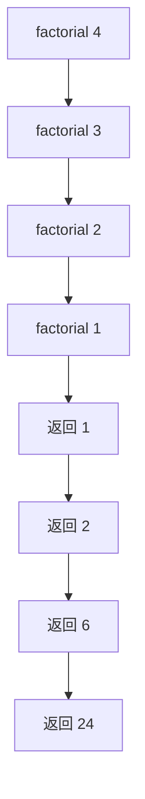

### 递归函数

递归函数在函数体内调用自己。写递归时先问两个问题：什么时候停止？每次调用是否更接近停止条件？阶乘的基例是 `0! = 1`，递推关系是 `n! = n * (n-1)!`。

```c
unsigned long long factorial(unsigned n) {
    if (n <= 1) return 1;
    return n * factorial(n - 1);
}
```

调用 `factorial(4)` 时，程序先压入 4、3、2、1 四层栈帧，再按相反顺序返回结果：



递归很适合树遍历、分治和回溯；简单计数通常用循环更省栈空间。朴素递归斐波那契会重复计算同一个子问题，复杂度接近指数级。可以用数组记忆已经得到的结果，或者直接改成自底向上的循环。

运行这些示例时，终端工作目录为 `/home/shanchuan/CStudy`，完整输出见本节末的终端截图。
