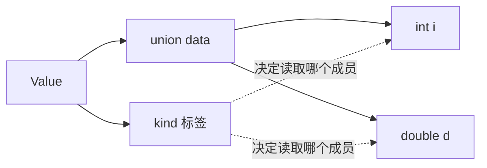

### 结构体的布局、联合体与枚举

结构体把多个成员放在同一个对象中，成员地址按声明顺序递增，但中间可能有填充字节：

```c
#include <stddef.h>
#include <stdio.h>

typedef struct {
    char name[16];
    int score;
} Student;

int main(void) {
    printf("size=%zu, score offset=%zu\\n",
           sizeof(Student), offsetof(Student, score));
}
```

`sizeof(Student)` 不一定等于两个成员大小之和。结构体直接写入文件前，要确认字节序、对齐和整数宽度；面向交换的数据格式应逐字段编码，而不是把内存原样倾倒出去。

联合体的所有成员共享同一段存储，适合表示“同一位置可能有不同类型”的数据。联合体本身不记录当前有效成员，通常要配一个枚举标签：

```c
enum ValueKind { VALUE_INT, VALUE_DOUBLE };
typedef struct {
    enum ValueKind kind;
    union { int i; double d; } data;
} Value;
```



枚举常量让代码脱离“魔法数字”。从文件或用户输入得到整数时，仍然要检查它是否落在允许的枚举范围内。

